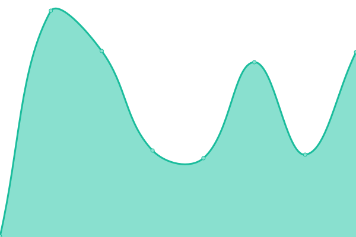

# [📈 Live Status](https://demo.upptime.js.org): <!--live status--> **🟩 All systems operational**

This repository contains the open-source uptime monitor and status page for [Upptime](https://upptime.js.org), powered by [Upptime](https://github.com/upptime/upptime).

With [Upptime](https://upptime.js.org), you can get your own unlimited and free uptime monitor and status page, powered entirely by a GitHub repository. We use [Issues](https://github.com/upptime/upptime/issues) as incident reports, [Actions](https://github.com/rpharaniya/websites-uptime-monitor/actions) as uptime monitors, and [Pages](https://demo.upptime.js.org) for the status page.

<!--start: status pages-->
<!-- This summary is generated by Upptime (https://github.com/upptime/upptime) -->
<!-- Do not edit this manually, your changes will be overwritten -->
<!-- prettier-ignore -->
| URL | Status | History | Response Time | Uptime |
| --- | ------ | ------- | ------------- | ------ |
|  [Portfolio](https://rajharaniya.me) | 🟩 Up | [portfolio.yml](https://github.com/rpharaniya/websites-uptime-monitor/commits/HEAD/history/portfolio.yml) | 

 260ms
     
 | 

<a href="https://rpharaniya.github.io/websites-uptime-monitor/history/portfolio">100.00%</a>
    

|  [AVZ Consulting](https://avzconsulting.be/) | 🟩 Up | [avz-consulting.yml](https://github.com/rpharaniya/websites-uptime-monitor/commits/HEAD/history/avz-consulting.yml) | 

 263ms
     
 | 

<a href="https://rpharaniya.github.io/websites-uptime-monitor/history/avz-consulting">100.00%</a>
    

|  [Umiya Agro Solvex](https://umiyaagrosolvex.com/) | 🟩 Up | [umiya-agro-solvex.yml](https://github.com/rpharaniya/websites-uptime-monitor/commits/HEAD/history/umiya-agro-solvex.yml) | 

 2051ms
     
 | 

<a href="https://rpharaniya.github.io/websites-uptime-monitor/history/umiya-agro-solvex">100.00%</a>
    

|  [Jay Industries](https://jaybrassindustries.com/) | 🟩 Up | [jay-industries.yml](https://github.com/rpharaniya/websites-uptime-monitor/commits/HEAD/history/jay-industries.yml) | 

 1544ms
     
 | 

<a href="https://rpharaniya.github.io/websites-uptime-monitor/history/jay-industries">100.00%</a>
    

|  [Maxx Techno Cast](http://maxxtechnocast.com/) | 🟩 Up | [maxx-techno-cast.yml](https://github.com/rpharaniya/websites-uptime-monitor/commits/HEAD/history/maxx-techno-cast.yml) | 

 167ms
     
 | 

<a href="https://rpharaniya.github.io/websites-uptime-monitor/history/maxx-techno-cast">100.00%</a>
    

|  [Silico Rubber Polymers](https://silicorubberpolymers.com/) | 🟩 Up | [silico-rubber-polymers.yml](https://github.com/rpharaniya/websites-uptime-monitor/commits/HEAD/history/silico-rubber-polymers.yml) | 

 1825ms
     
 | 

<a href="https://rpharaniya.github.io/websites-uptime-monitor/history/silico-rubber-polymers">100.00%</a>
    

|  [ShredX](https://shredx.in/) | 🟩 Up | [shred-x.yml](https://github.com/rpharaniya/websites-uptime-monitor/commits/HEAD/history/shred-x.yml) | 

 252ms
     
 | 

<a href="https://rpharaniya.github.io/websites-uptime-monitor/history/shred-x">100.00%</a>
    

|  [Evon Ceramics](http://evonceramics.com/) | 🟩 Up | [evon-ceramics.yml](https://github.com/rpharaniya/websites-uptime-monitor/commits/HEAD/history/evon-ceramics.yml) | 

 170ms
     
 | 

<a href="https://rpharaniya.github.io/websites-uptime-monitor/history/evon-ceramics">100.00%</a>
    

<!--end: status pages-->

[**Visit our status website →**](https://demo.upptime.js.org)

## 📄 License

- Powered by: [Upptime](https://github.com/upptime/upptime)
- Code: [MIT](./LICENSE) © [Upptime](https://upptime.js.org)
- Data in the `./history` directory: [Open Database License](https://opendatacommons.org/licenses/odbl/1-0/)
