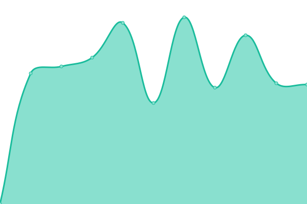
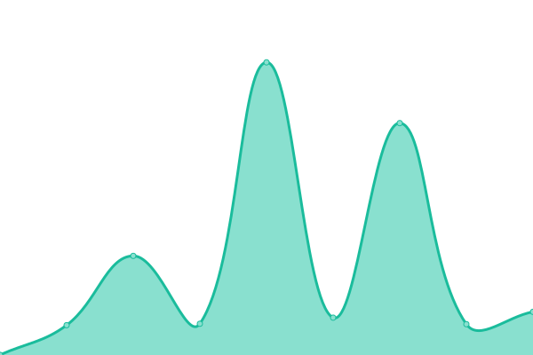
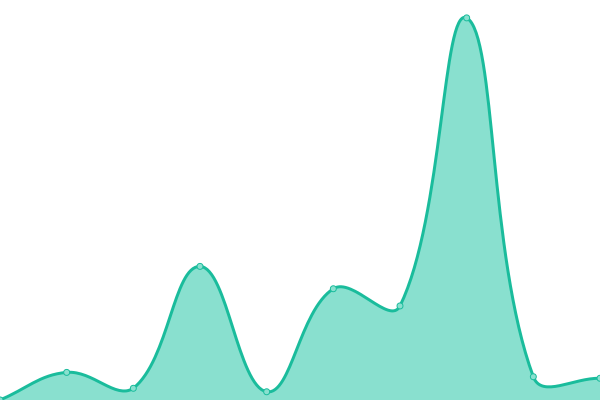
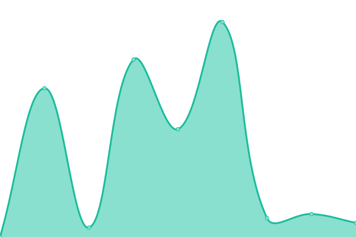
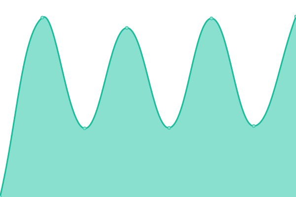
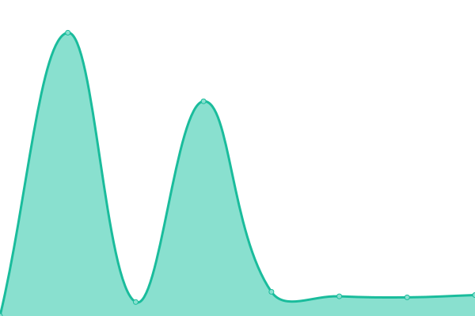
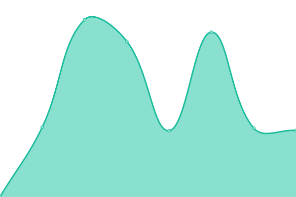

# [📈 Live Status](https://rpharaniya.github.io/websites-uptime-monitor/): <!--live status--> **🟧 Partial outage**

This is the open-source uptime monitor and status page for websites developed by [Raj Haraniya](https://rajharaniya.me), powered by [Upptime](https://github.com/upptime/upptime).

With [Upptime](https://upptime.js.org), you can get your own unlimited and free uptime monitor and status page, powered entirely by a GitHub repository. We use [Issues](https://github.com/upptime/upptime/issues) as incident reports, [Actions](https://github.com/rpharaniya/websites-uptime-monitor/actions) as uptime monitors, and [Pages](https://demo.upptime.js.org) for the status page.

<!--start: status pages-->
<!-- This summary is generated by Upptime (https://github.com/upptime/upptime) -->
<!-- Do not edit this manually, your changes will be overwritten -->
<!-- prettier-ignore -->
| URL | Status | History | Response Time | Uptime |
| --- | ------ | ------- | ------------- | ------ |
|  [Raj Haraniya - Portfolio](https://rajharaniya.me) | 🟩 Up | [raj-haraniya-portfolio.yml](https://github.com/rpharaniya/websites-uptime-monitor/commits/HEAD/history/raj-haraniya-portfolio.yml) | 

 1865ms
     
 | 

<a href="https://rpharaniya.github.io/websites-uptime-monitor/history/raj-haraniya-portfolio">100.00%</a>
    

|  [AVZ Consulting](https://avzconsulting.be/) | 🟥 Down | [avz-consulting.yml](https://github.com/rpharaniya/websites-uptime-monitor/commits/HEAD/history/avz-consulting.yml) | 

 0ms
     
 | 

<a href="https://rpharaniya.github.io/websites-uptime-monitor/history/avz-consulting">0.00%</a>
    

|  [Umiya Agro Solvex](https://umiyaagrosolvex.com/) | 🟩 Up | [umiya-agro-solvex.yml](https://github.com/rpharaniya/websites-uptime-monitor/commits/HEAD/history/umiya-agro-solvex.yml) | 

 2261ms
     
 | 

<a href="https://rpharaniya.github.io/websites-uptime-monitor/history/umiya-agro-solvex">100.00%</a>
    

|  [Jay Industries](https://jaybrassindustries.com/) | 🟩 Up | [jay-industries.yml](https://github.com/rpharaniya/websites-uptime-monitor/commits/HEAD/history/jay-industries.yml) | 

 1154ms
     
 | 

<a href="https://rpharaniya.github.io/websites-uptime-monitor/history/jay-industries">100.00%</a>
    

|  [Maxx Techno Cast](http://maxxtechnocast.com/) | 🟩 Up | [maxx-techno-cast.yml](https://github.com/rpharaniya/websites-uptime-monitor/commits/HEAD/history/maxx-techno-cast.yml) | 

 1718ms
     
 | 

<a href="https://rpharaniya.github.io/websites-uptime-monitor/history/maxx-techno-cast">100.00%</a>
    

|  [Silico Rubber Polymers](https://silicorubberpolymers.com/) | 🟩 Up | [silico-rubber-polymers.yml](https://github.com/rpharaniya/websites-uptime-monitor/commits/HEAD/history/silico-rubber-polymers.yml) | 

 2440ms
     
 | 

<a href="https://rpharaniya.github.io/websites-uptime-monitor/history/silico-rubber-polymers">100.00%</a>
    

|  [ShredX](https://shredx.in/) | 🟩 Up | [shred-x.yml](https://github.com/rpharaniya/websites-uptime-monitor/commits/HEAD/history/shred-x.yml) | 

 1397ms
     
 | 

<a href="https://rpharaniya.github.io/websites-uptime-monitor/history/shred-x">100.00%</a>
    

|  [Evon Ceramics](http://evonceramics.com/) | 🟩 Up | [evon-ceramics.yml](https://github.com/rpharaniya/websites-uptime-monitor/commits/HEAD/history/evon-ceramics.yml) | 

 2296ms
     
 | 

<a href="https://rpharaniya.github.io/websites-uptime-monitor/history/evon-ceramics">99.83%</a>
    

|  [ESKRY Beats](https://eskrybeats.com/) | 🟩 Up | [eskry-beats.yml](https://github.com/rpharaniya/websites-uptime-monitor/commits/HEAD/history/eskry-beats.yml) | 

 143ms
     
 | 

<a href="https://rpharaniya.github.io/websites-uptime-monitor/history/eskry-beats">100.00%</a>
    

|  [A&S Home Health Care](https://ashhc.com/) | 🟩 Up | [a-and-s-home-health-care.yml](https://github.com/rpharaniya/websites-uptime-monitor/commits/HEAD/history/a-and-s-home-health-care.yml) | 

 1342ms
     
 | 

<a href="https://rpharaniya.github.io/websites-uptime-monitor/history/a-and-s-home-health-care">100.00%</a>
    

|  [Breze Cleaning](https://brezecleaning.com/) | 🟥 Down | [breze-cleaning.yml](https://github.com/rpharaniya/websites-uptime-monitor/commits/HEAD/history/breze-cleaning.yml) | 

 620ms
     
 | 

<a href="https://rpharaniya.github.io/websites-uptime-monitor/history/breze-cleaning">99.81%</a>
    

|  [Capital Tech Services LLP](https://capitaltechservicesllc.com/) | 🟩 Up | [capital-tech-services-llp.yml](https://github.com/rpharaniya/websites-uptime-monitor/commits/HEAD/history/capital-tech-services-llp.yml) | 

 352ms
     
 | 

<a href="https://rpharaniya.github.io/websites-uptime-monitor/history/capital-tech-services-llp">100.00%</a>
    

|  [Amey Transport](https://ameytransport.com/) | 🟩 Up | [amey-transport.yml](https://github.com/rpharaniya/websites-uptime-monitor/commits/HEAD/history/amey-transport.yml) | 

 331ms
     
 | 

<a href="https://rpharaniya.github.io/websites-uptime-monitor/history/amey-transport">100.00%</a>
    

|  [Digital Global Hub](https://digitalglhub.com/) | 🟥 Down | [digital-global-hub.yml](https://github.com/rpharaniya/websites-uptime-monitor/commits/HEAD/history/digital-global-hub.yml) | 

 299ms
     
 | 

<a href="https://rpharaniya.github.io/websites-uptime-monitor/history/digital-global-hub">99.79%</a>
    

|  [Vida Rising Star](https://vidasrisingstars.com/) | 🟥 Down | [vida-rising-star.yml](https://github.com/rpharaniya/websites-uptime-monitor/commits/HEAD/history/vida-rising-star.yml) | 

 0ms
     
 | 

<a href="https://rpharaniya.github.io/websites-uptime-monitor/history/vida-rising-star">0.00%</a>
    

|  [AHR Services Inc](https://ahrheatingandcooling.com/) | 🟩 Up | [ahr-services-inc.yml](https://github.com/rpharaniya/websites-uptime-monitor/commits/HEAD/history/ahr-services-inc.yml) | 

 348ms
     
 | 

<a href="https://rpharaniya.github.io/websites-uptime-monitor/history/ahr-services-inc">100.00%</a>
    

|  [Adriana Dinu Tennis Academy](https://adrianadinutennisacademy.com/) | 🟥 Down | [adriana-dinu-tennis-academy.yml](https://github.com/rpharaniya/websites-uptime-monitor/commits/HEAD/history/adriana-dinu-tennis-academy.yml) | 

 482ms
     
 | 

<a href="https://rpharaniya.github.io/websites-uptime-monitor/history/adriana-dinu-tennis-academy">83.76%</a>
    

|  [Mary & Nancy Intention Teddy](https://marynancy.com/) | 🟩 Up | [mary-and-nancy-intention-teddy.yml](https://github.com/rpharaniya/websites-uptime-monitor/commits/HEAD/history/mary-and-nancy-intention-teddy.yml) | 

 188ms
     
 | 

<a href="https://rpharaniya.github.io/websites-uptime-monitor/history/mary-and-nancy-intention-teddy">100.00%</a>
    

|  [Basserah Center](https://baseerahcenter.com/) | 🟩 Up | [basserah-center.yml](https://github.com/rpharaniya/websites-uptime-monitor/commits/HEAD/history/basserah-center.yml) | 

 588ms
     
 | 

<a href="https://rpharaniya.github.io/websites-uptime-monitor/history/basserah-center">100.00%</a>
    

|  [MK Renovation & Remodel](https://mkrenovationremodel.com/) | 🟩 Up | [mk-renovation-and-remodel.yml](https://github.com/rpharaniya/websites-uptime-monitor/commits/HEAD/history/mk-renovation-and-remodel.yml) | 

 356ms
     
 | 

<a href="https://rpharaniya.github.io/websites-uptime-monitor/history/mk-renovation-and-remodel">100.00%</a>
    

|  [My Fair Delivery](https://mayfairdelivery.com/) | 🟩 Up | [my-fair-delivery.yml](https://github.com/rpharaniya/websites-uptime-monitor/commits/HEAD/history/my-fair-delivery.yml) | 

 1463ms
     
 | 

<a href="https://rpharaniya.github.io/websites-uptime-monitor/history/my-fair-delivery">100.00%</a>
    

<!--end: status pages-->

[**Visit our status website →**](https://rpharaniya.github.io/websites-uptime-monitor/)

## 📄 License

- Powered by: [Upptime](https://github.com/upptime/upptime)
- Code: [MIT](./LICENSE) © [Upptime](https://upptime.js.org)
- Data in the `./history` directory: [Open Database License](https://opendatacommons.org/licenses/odbl/1-0/)
